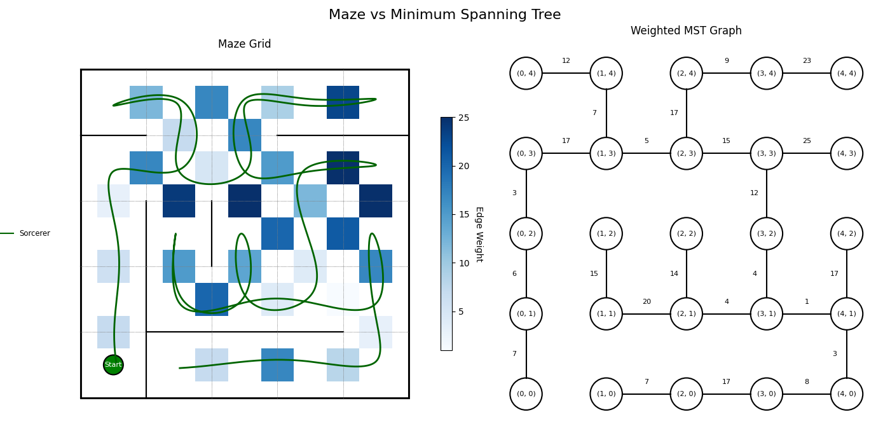
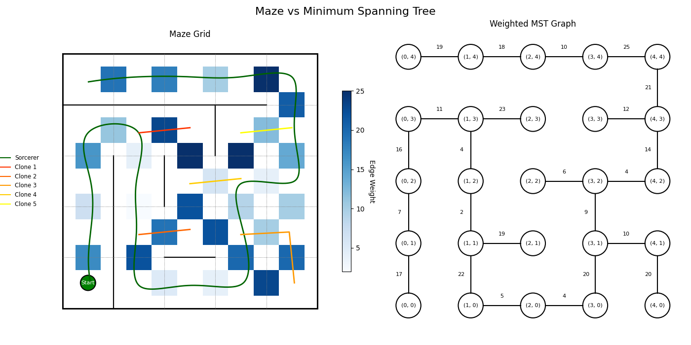
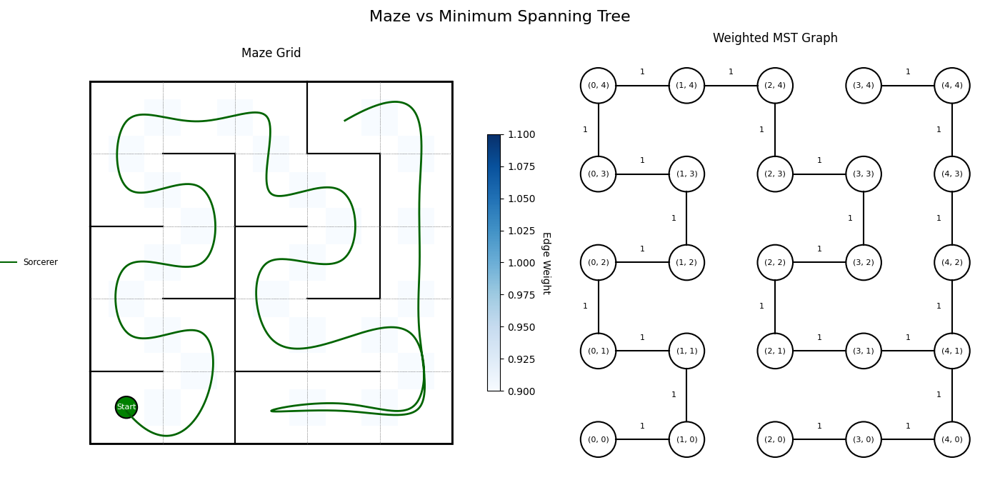
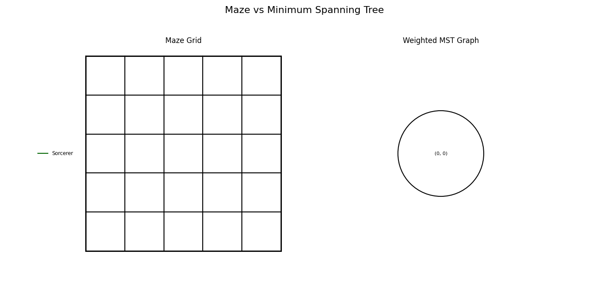
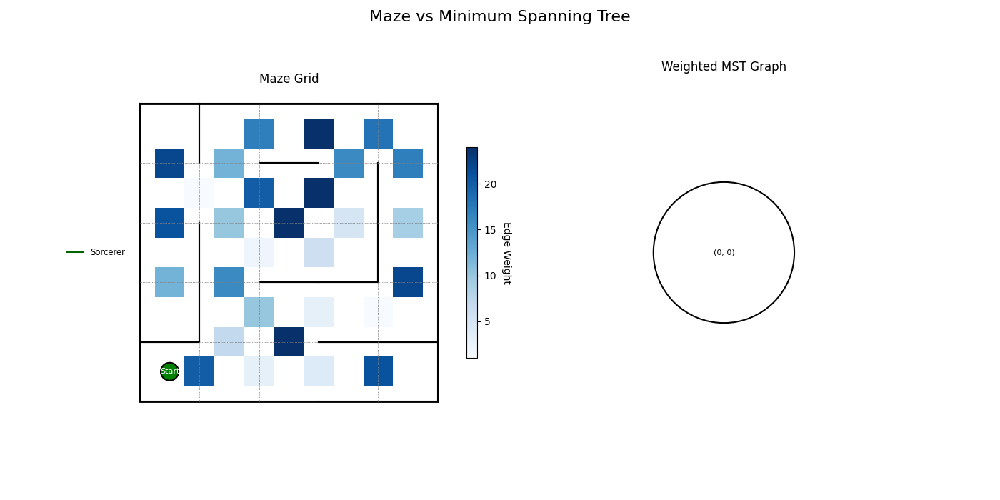

# Takehome-Assignment-Maze-of-Many

## Overview

This is the skeleton code for Algorithms and Analysis COSC2123/3119 - *The Maze of Many: An Exploration of Graph Traversal and Planning Problems*. 
Across multiple tasks in this assignment, you will design and implement algorithms that represent, construct, and navigate a mazes (with a twist!). 
You will address scenarios where you may create clones to help you explore the maze more efficiently.

[Additional information, as well as the specification, can be found here.](https://rmit.instructure.com/courses/141655/assignments/1139358)

## Technical Specification

The main script is *maze_runner.py*. It is in the same folder as this README, and is run with the command:

```python .\maze_runner.py <config_file>```

In order to run the code, you must:
1. Be using a Python version >=3.13 (check your python version by running ```python --version```);
2. install the requirements by running ```pip install -r .\requirements.txt```; and
3. have a configuration file. 

The configuration file contains all the parameters that are needed to:
- define the maze parameters;
- construct a maze;
- create a minimum-spanning tree of the maze;
- generate a path through the maze; and
- create a visual output.
- save the maze to a .txt file

An example configuration file is given to you (*config.json*). 
Feel free to make your own configuration files in order to experiment with different mazes, solvers, clone cost, etc.
Configuration files take the form of:

```json
{
  "rows": 5,                 <- number of rows in the maze
  "cols": 5,                 <- number of columns in the maze
  "entrance": {              <- parameter to hold entrance (starting cell location)
    "row": 0,                <- the row number of this starting cell
    "col": 0                 <- the column number of this starting cell
  },
  "graph_type": "matrix",    <- the graph representation (matrix or list)
  "maze_generator": "dfs",   <- the maze generator method (do not change)
  "maze_solver": "no_clone", <- path generation technique (no_clone, always_clone, or task_d)
  "clone_cost": 10,          <- the cost of creating a clone
  "mst_generator": "prims",  <- the MST generation method (prims or kruskals)
  "wall_removal_perc": 20,   <- after generating a maze, remove this percentage of walls (0 if you want no cycles/loops)
  "max_weight": 25,          <- the maximum edge weight between vertices (cost of moving to a room)
  "visualise": true,         <- should we output a plot? (true if yes, false if no [requires matplotlib/scipy])
  "print_struct": false,     <- prints the graph data structure to the console (useful for debugging)
  "load_maze": false,        <- load a <maze_name>.txt file maze from the mazes folder (true if yes, false if no)
  "save_maze": false,        <- save this maze as <maze_name>.txt in the mazes folder (useful if comparing methods)
  "maze_name": "testMaze"    <- what maze should we save or load?
}
```

The default output upon running ```python .\maze_runner.py .\config.json``` will give you a plot similar to this:



Here we can see:
- In the left panel:
  - A maze;
  - A starting cell (green circle);
  - walls between adjacent cells (black lines);
  - paths between adjacent cells where there is no wall (blue squares) between 1 and max_weight; and
  - the path the sorcerer has walked to explore the whole maze (green line).
- In the right panel:
  - A valid MST of the maze;
  - labelled weights; and
  - vertices with cell maps ((0,0) is bottom left, etc)

In addition, the console will output configuration settings and behaviour, for example:

```commandline
--------------- Maze of Many ---------------
Loading maze from file: mazes/specMaze.txt
Maze loaded from mazes/specMaze.txt as matrix graph
Generating MST using: prims
Solving maze using no_clone with a clone cost of 5
Cost of traversal (max cost of (1) inheritance + (2) clone creation + (3) travel for single entity): 50
Number of clones: 0
Launching visualisation...
--------------- Run Complete ---------------
```

Changing aspects of the config will change which functions and behaviours we use. For example, changing
maze_solver from "no_clone" to "always_clone" enforces a new exploration behaviour by the sorcerer:



Now we can see that the sorcerer makes new clones to explore sub-branches of the maze (according to some condition).

Changing max_weight to 1 and wall_removal_perc to 0 ensures we have a maze with no loops/cycles with uniform edge weights:



Changing the graph_type from "matrix" to "list" will give a maze of all walls until you implement the list:



And changing mst_generator from "prims" to "kruskals" will give a bad MST until you implement Kruskal's algorithm:



Be sure to play around with the configuration and experiment to understand how the code works.
You may save and load mazes by switching the flags in the configuration file (see the json above). 
You must give a filename when saving a maze, and give an existing file name to load a maze. See
the contents of the ```mazes``` folder for your current mazes.

## Testing

To keep you on the right track, we have created two short test suites for the adjacency list and Kruskal's algorithm
implementations. Running:

```python -m tests.test_list```

will run the tests for the list implementation, and running:

```python -m tests.test_kruskals```

will run the tests for Kruskal's algorithm. 

In addition, for your Task D solution to be applicable, it must visit the entire maze. If your solution
does not meet this requirement, you will get a print statement saying

```Coverage error: missing X nodes → [Coordinates]}```

**Please be aware that passing all the tests for these test suites
does not guarantee full implementation marks - these test suites are not exhaustive and the auto-testing suite
will be much more rigourous**

## Software Engineering Practices

Part of your mark is formed by following good SE practices. For full details on this, please see the FAQ on EdStem.
We expect:
- clean, concise code (where possible);
- comments detailing logic; and
- commits demonstrating an iterative improvement process

Commits make an important part of the development here. New features, bug fixtures, and experimentation should
all have descriptive commit messages, e.g.:

```implemented neihgbours function for adjacency list```

```fixed bug where neigbours function returned non-adjacent cells```

etc.

